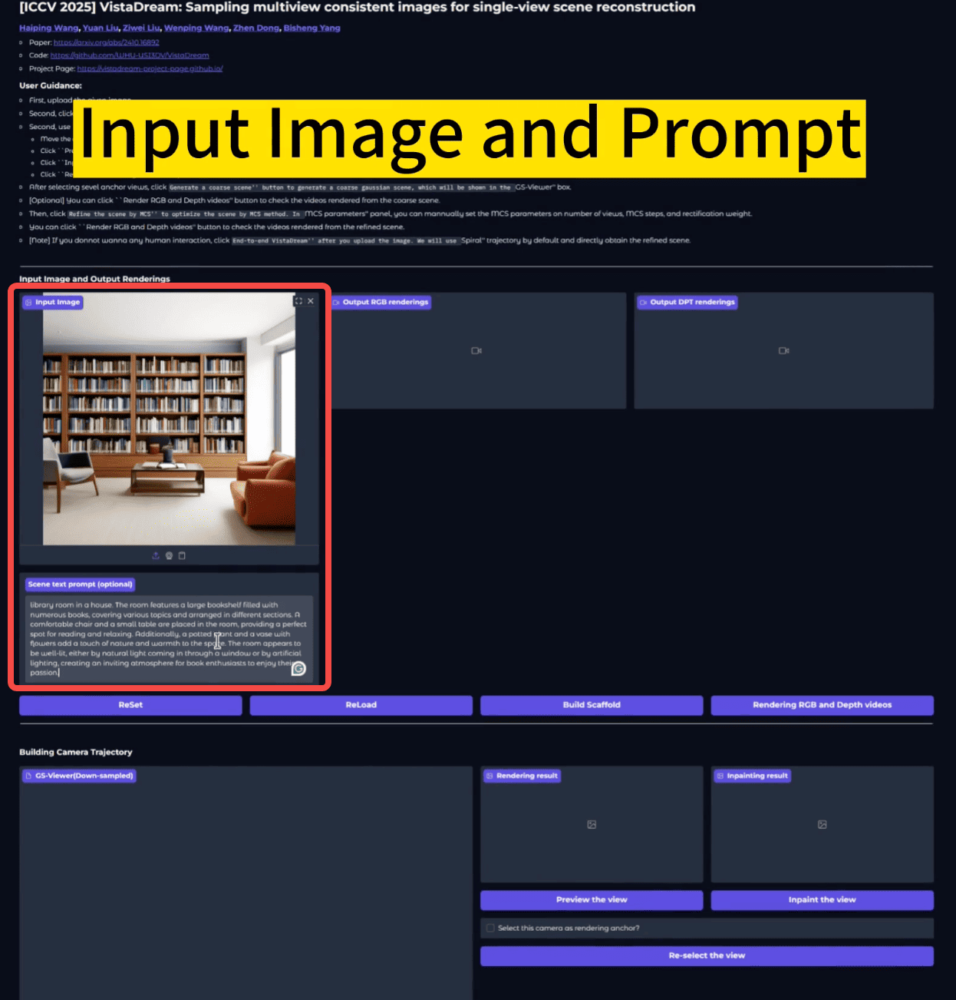
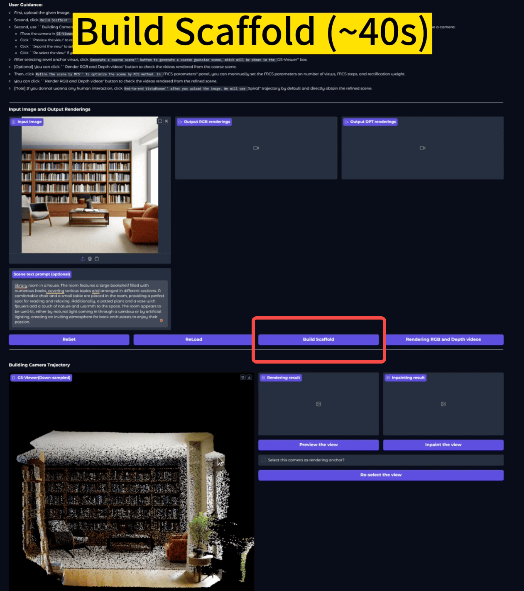
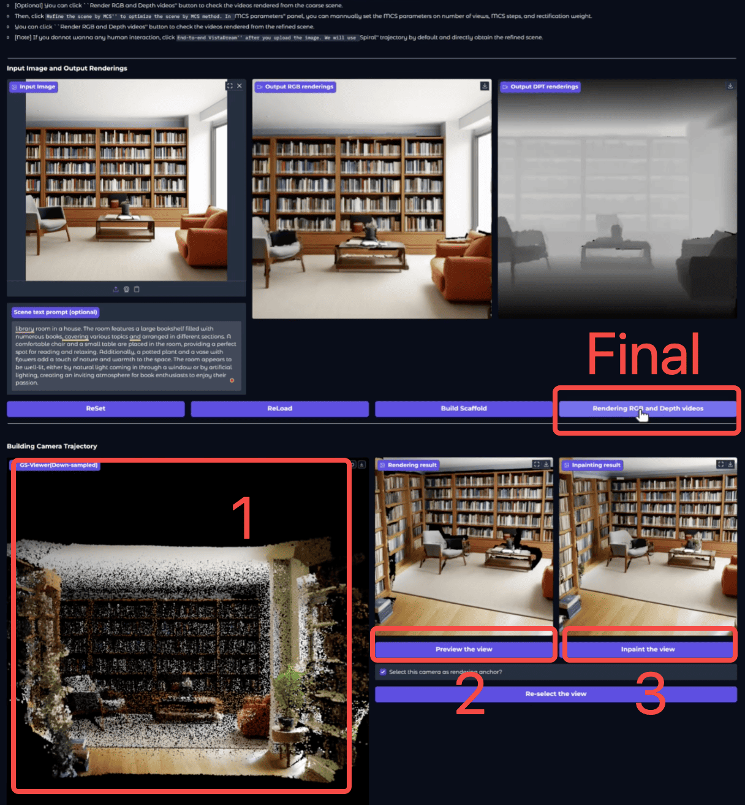
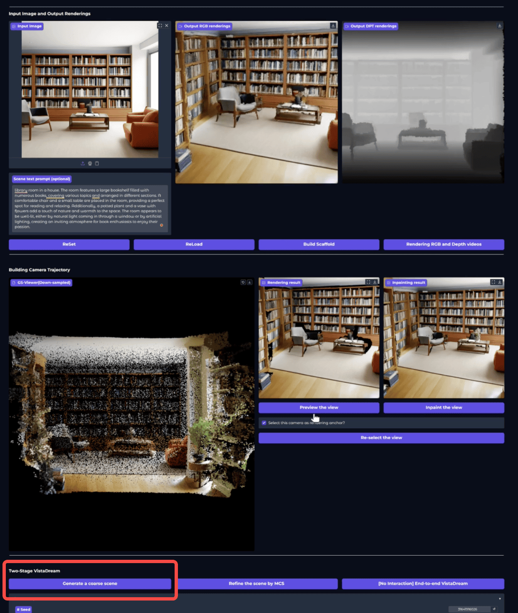
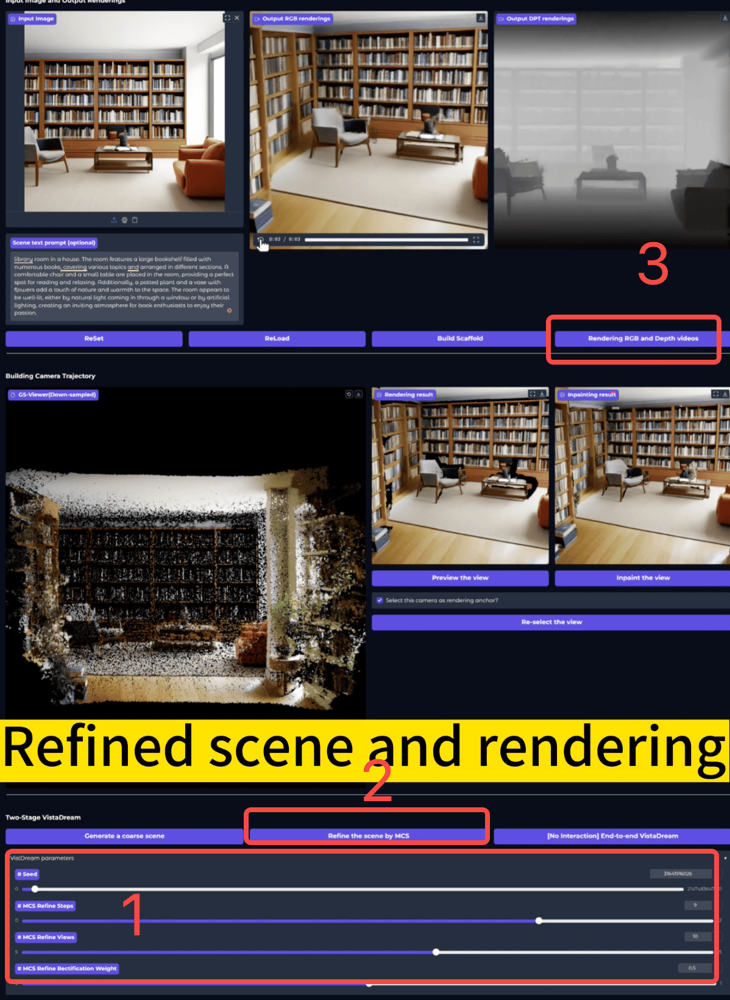

### Interface for interactive scene generation

#### Overview
-----------------------

<p align="center">
	
</p>

#### Pipeline
------------------------
1. Strongly recommend running `DESCRIBE.py` first to generate an offline image description, which avoids loading the LLaVA model inside the interface and reduces the risk of freezing.
   
    ```
    python DESCRIBE.py --image <your-image-fn>
    ```

2. Run `INTERFACE.py`.
    ```
    python INTERFACE.py
    ```
3. Provide the input image and the pre-generated image description in the interface.

     <p align="center">
         
     </p>

    **NOTE:** If no image description is provided, the interface will automatically load LLaVA to generate one, which may cause an out-of-memory error or freezing!

4. Click `Build scaffold` to automatically generate a basic scene scaffold.
   
      <p align="center">
         
     </p>

5. Perform interactive warp and inpaint. First, interactively adjust the Gaussian view, then use `Preview` to check whether the viewpoint is appropriate, and finally click `Inpaint`.

      <p align="center">
         
     </p>

    **NOTE:** 
    - Make sure `Select this camera as rendering anchor` is checked. This allows subsequent rendering and completion to interpolate trajectories along the selected anchor views.

    - If the completion result is unsatisfactory, click `Re-select the view` to choose a new viewpoint and run completion again. In practice, using no more than 5 completion views is recommended.
    
    - Cycle above `Preview-Inpaint` steps. We suggest to select <5 warp&inpaint anchor frames.

    - Click `Rendering RGB and Depth videos` above to render videos along the anchor-view trajectory. This preview helps identify regions that are still missing.

6. Click `Generate a coarse scene` to automatically complete the regions along the trajectory that are not covered by the selected anchor views.

      <p align="center">
         
     </p>

7. Adjust the MCS hyperparameters in the panel below, then click `Refine the scene by MCS` to optimize the scene. Then, click `Rendering RGB and Depth videos` to render videos of the refined scene.

      <p align="center">
         
     </p>

8. All scene `.pth` files and splat files are stored in the most recent folder under `temp/`. If you need to modify a specific scene, set `t` on line 15 of `INTERFACE.py` to the target folder, then click `ReLoad` to load that scene and continue editing it.


